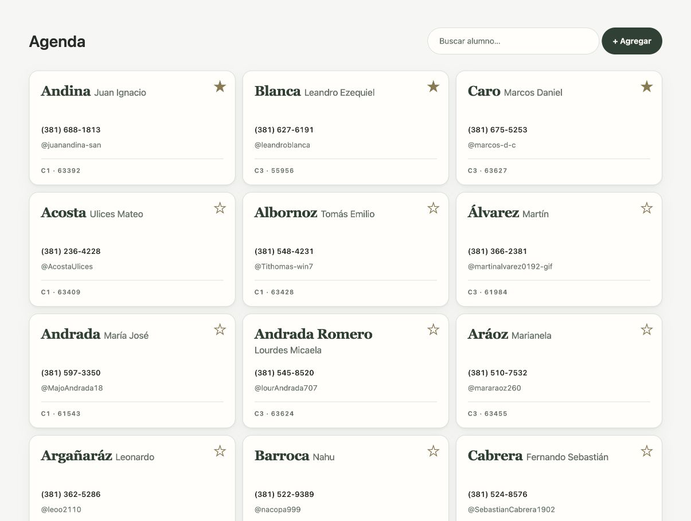
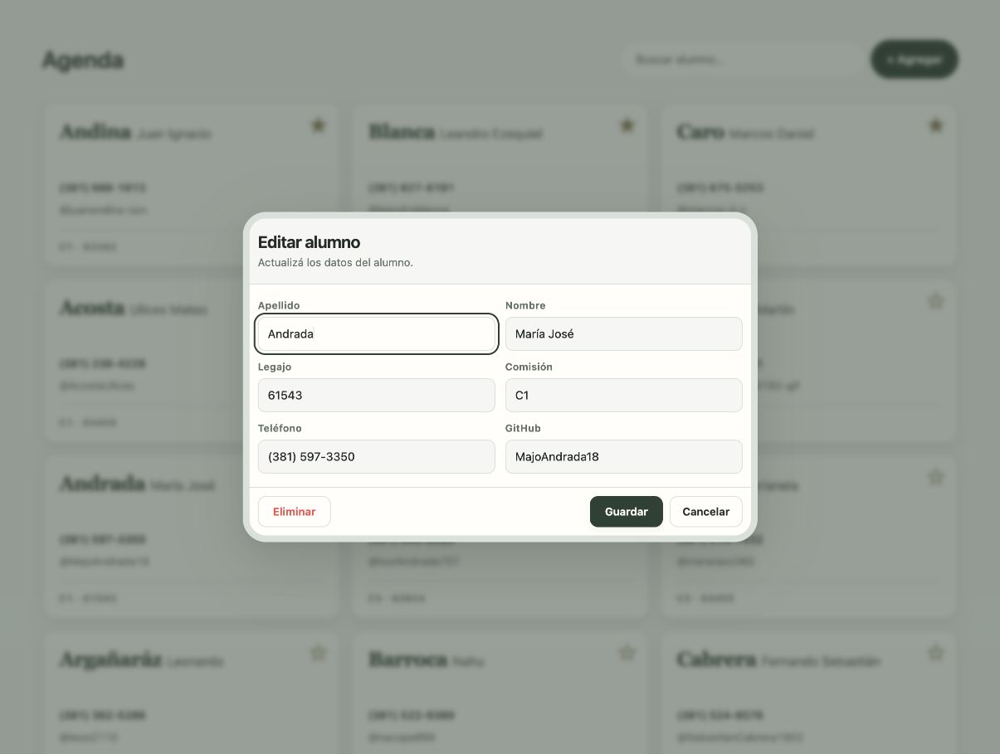

<h1 align="center">Programación IV</h1>

  <strong>Programación Web · TUP26</strong> 
  Ing. Alejandro Di Battista

---

# TP3 — Agenda reactiva

## Objetivo

Desarrollar una aplicación web de agenda para administrar alumnos. Debe permitir consultar, buscar, agregar, editar, marcar como favorito y eliminar registros.

Los datos deben persistirse utilizando `localStorage`, de modo que los cambios se conserven al recargar la página. La aplicación debe implementarse en un único archivo autocontenido llamado `agenda.html`, utilizando [Arrow.js](https://arrow-js.com/) como framework de interfaz reactiva.

## Datos iniciales y persistencia

- Cargar los datos iniciales desde [`alumnos.json`](enunciados/tp3/alumnos.json).
- Si no existe información guardada, utilizar ese archivo y crear el almacenamiento local.
- Al recargar, recuperar los datos desde `localStorage`.
- Persistir altas, modificaciones, eliminaciones y cambios de favorito.
- Cada alumno contiene, como mínimo: `id`, `apellido`, `nombre`, `legajo`, `comision`, `telefono`, `github` y `favorito`.

## Funcionalidad

### Agenda

Mostrar los alumnos en tarjetas con apellido, nombre, teléfono, usuario de GitHub, comisión, legajo y control de favorito.

Los favoritos deben aparecer primero. Dentro de cada grupo, ordenar alfabéticamente por apellido y luego por nombre, sin distinguir mayúsculas ni acentos.

### Búsqueda

Incorporar una búsqueda en caliente. La lista debe actualizarse mientras se escribe, sin recargar la página, y no debe distinguir mayúsculas, minúsculas ni acentos.

### Alta

El botón **Agregar** debe abrir un diálogo con un formulario para ingresar apellido, nombre, legajo, comisión, teléfono y usuario de GitHub. Al guardar, validar los datos, crear un identificador, incorporar el alumno y cerrar el diálogo.

### Edición y eliminación

Al seleccionar una tarjeta, abrir un diálogo con los datos actuales del alumno. El formulario debe permitir guardar cambios, cancelar o eliminar.

La opción **Eliminar** solo debe aparecer durante la edición de un alumno existente. La eliminación debe quitar el alumno del listado y de `localStorage`. Cancelar no debe modificar los datos.

## Requisitos técnicos

- Usar Arrow.js para el estado reactivo, las plantillas y la actualización de la interfaz.
- Entregar un único archivo `agenda.html` autocontenido.
- No depender de archivos JavaScript o CSS propios separados.
- Cargar `alumnos.json` mediante `import` desde un servidor HTTP local.
- Mantener separados el estado, las funciones de actualización y la representación.
- Usar marcado semántico: `main`, `header`, `section`, `article`, `address`, `footer`, `dialog` y `form`.
- Organizar el CSS por componente, utilizando selectores estructurales y reglas anidadas de CSS Nesting.
- Permitir el uso del teclado: enfocar tarjetas, editar con `Enter` y alternar favoritos con la barra espaciadora.

## Entrega

Entregar `agenda.html` funcionando. Si es necesario, incluir una breve instrucción para servir la carpeta mediante HTTP y cargar `alumnos.json`.

> [!IMPORTANT]
> La entrega debe realizarse hasta el **lunes 28 de septiembre de 2026, inclusive**.

La solución debe respetar la composición general de las pantallas de referencia: encabezado, buscador, grilla de tarjetas, favoritos y diálogo de edición. Los colores y tipografías pueden aproximarse mientras se conserve la organización visual.

