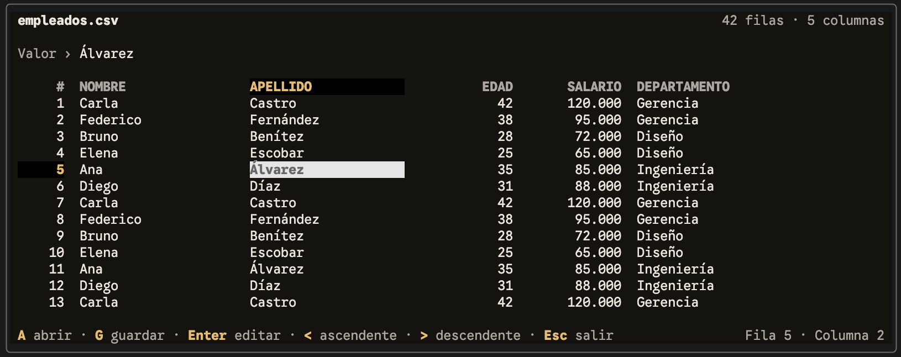
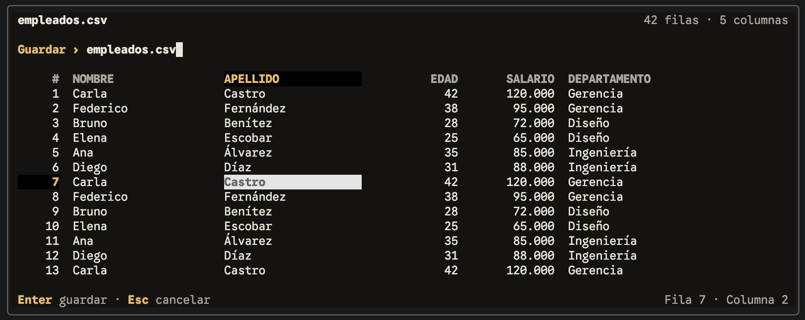

# Trabajo práctico 2: Editor de CSV

> [!IMPORTANT]
> **Fecha de presentación:** hasta el próximo martes 15 de septiembre inclusive.

Desarrollar una aplicación de terminal con JavaScript, React e Ink que permita abrir, visualizar, editar, ordenar y guardar archivos CSV, tomando como referencia las siguientes pantallas:

**Visualización:** mostrar los datos del archivo en una tabla y permitir navegar entre sus celdas.



**Guardado:** al presionar **G**, solicitar el nombre del archivo donde se guardarán los datos.



- Mostrar los datos en una tabla con cabecera y filas numeradas, el nombre del archivo y la cantidad de filas y columnas.
- Si se ejecuta el comando con el nombre de un archivo CSV como argumento, abrirlo y mostrar sus datos directamente, sin volver a solicitar el nombre del archivo.
- Navegar entre celdas con las flechas, resaltar la celda seleccionada y mostrar su valor y posición. Desplazar la vista cuando sea necesario.
- Ordenar las filas por la columna seleccionada usando `<` para orden ascendente y `>` para orden descendente.
- Implementar las acciones indicadas: **A** para abrir un archivo, **G** para guardar, **Enter** para editar la celda y **Esc** para cancelar una acción o salir.
- Al usar **A** para abrir o **G** para guardar, pedir al usuario el nombre del archivo. Mostrar un mensaje si ocurre un error.

Usaremos el **formato más simple posible de CSV**: primera línea con cabecera, campos separados por coma y un registro por línea, con igual cantidad de campos en todas las filas. Los campos no contendrán caracteres especiales: comas, comillas ni saltos de línea internos; no será necesario implementar escapes ni campos entrecomillados.


> Nota:
 Para configurar el proyecto y poder ejecutarlo:

```bash
npm install
npm install --global tsx
npm link
```

Luego se puede ejecutar el editor como comando con:

```bash
edit empleados.csv
```
